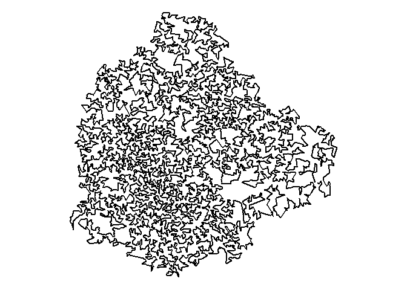
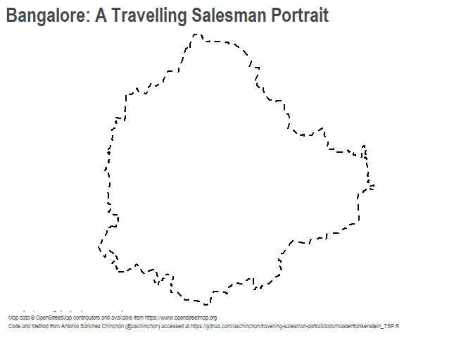

Day15
================
Anirudh Govind
(16 November, 2020)

# Day 2 - Edit

## Get Data

``` r
# Load Bangalore ward boundaries

bangaloreWardBoundary <- read_sf(here::here("data/raw-data/bangaloreWardBoundary.shp"))

bangaloreWardBoundary <- bangaloreWardBoundary%>% 
  st_transform(3857)
```

``` r
# Load roads data (previously saved from OSM and cleaned up)

bangaloreRoads <- readRDS(here::here("data/derived-data/bangaloreRoads.rds"))
```

## Wrangle Data

``` r
# Count number of categories

# bangaloreRoads %>% 
#   group_by(highway) %>% 
#   count()

# There are 6 colours. So, I'll use a 7 or 8 color palette.
```

## Build Map

``` r
# Define palette

# c(#006466, #065A60, #0B525B, #144552, #1B3A4B, #212F45, #272640, #312244, #3E1F47, #4D194D)

# Alternate palette

# c(#2d00f7, #6a00f4, #8900f2, #a100f2, #b100e8, #bc00dd, #d100d1, #db00b6, #e500a4, #f20089)

# Alternate palette

# c(#dcdcdd, #c5c3c6, #46494c, #4c5c68, #1985a1)

# The first layer will be the ward boundary

mapBoundary <- tm_shape(bangaloreWardBoundary) +
  tm_fill(col = "#ffffff") + 
  tm_layout(bg.color = "#ffffff",
            frame = F,
            attr.outside = T,
            outer.margins = 0,
            asp = 0,
            scale = 0.8)

# The next layer will be the trunk roads

mapTrunk <- bangaloreRoads %>% 
  filter(highway == "trunk") %>% 
  tm_shape() +
  tm_lines(col = "#000000",
           lwd = 3.2)

# This will be followed by the motorways

mapMotorway <- bangaloreRoads %>% 
  filter(highway == "motorway") %>% 
  tm_shape() +
  tm_lines(col = "#000000",
           lwd = 2.8)

# Then the primary roads

mapPrimary <- bangaloreRoads %>% 
  filter(highway == "primary") %>% 
  tm_shape() +
  tm_lines(col = "#000000",
           lwd = 2.4)

# Now the secondary roads

mapSecondary <- bangaloreRoads %>% 
  filter(highway == "secondary") %>% 
  tm_shape() +
  tm_lines(col = "#000000",
           lwd = 2.0)

# Tertiary next

mapTertiary <- bangaloreRoads %>% 
  filter(highway == "tertiary") %>% 
  tm_shape() +
  tm_lines(col = "#000000",
           lwd = 1.6)

# And finally the residential

mapResidential <- bangaloreRoads %>% 
  filter(highway == "residential") %>% 
  tm_shape() +
  tm_lines(col = "#000000",
           lwd = 0.6)

BangaloresRoads <- mapBoundary + mapTrunk + mapMotorway + mapPrimary + mapSecondary + mapTertiary + mapResidential
```

## Export

``` r
# Export the map as an image to upload onto twitter

tmap_save(tm = BangaloresRoads,
          filename = here::here("exports/Day15-1.png"),
          dpi = 450,
          width = 200,
          height = 200,
          units = "mm")
```

    ## Map saved to G:\00_Git Repos\30DayMapChallenge\exports\Day15-1.png

    ## Resolution: 3543.307 by 3543.307 pixels

    ## Size: 7.874016 by 7.874016 inches (450 dpi)

# Day 15

## Get Data

Now I use the export from the previous step to create a TSP portrait for
fun\! I’m just curious about how different it looks from Bangalore’s
Roads.

``` r
# Load data

file <- load.image(here::here("exports/Day15-1.png"))
```

## Wrangle Data

``` r
data <- file %>% 
  as.data.frame() %>% 
  sample_n(8000, weight = (1-value)) %>% 
  select(x,y)
```

``` r
solution <- as.TSP(dist(data)) %>% 
  solve_TSP(method = "arbitrary_insertion") %>% 
  as.integer()
```

## Build Map

``` r
data_to_plot <- data[solution,]
```

``` r
ggplot(data_to_plot,
       aes(x, y)) +
  geom_path(size = 1) +
  scale_y_continuous(trans = reverse_trans()) +
  coord_fixed() +
  theme_void()
```

<!-- -->

## Export Raw Map

``` r
ggsave("bangaloreTSP.png", dpi=600, width = 8, height = 8)
```

## Export Template

``` r
# I'll use photoshop and place it into my default template.

templateMapBoundary <- tm_shape(bangaloreWardBoundary) +
  tm_fill(col = "#ffffff") + 
  tm_borders(col = "#000000",
             lwd = 3,
             lty = "dashed") +
  tm_layout(bg.color = "#ffffff",
            frame = F,
            attr.outside = T,
            outer.margins = 0,
            asp = 0,
            scale = 0.8,
            main.title = "Bangalore: A Travelling Salesman Portrait",
            main.title.color = "#46494c",
            main.title.size = 1.75,
            main.title.fontface = 2,
            main.title.fontfamily = "Arial Narrow") + 
  tm_credits("#30DayMapChallenge | Day 15 | Anirudh Govind | Nov 2020\nMap data © OpenStreetMap contributors and available from https://www.openstreetmap.org\nCode and Method from Antonio Sánchez Chinchón (@aschinchon) accessed at https://github.com/aschinchon/travelling-salesman-portrait/blob/master/frankenstein_TSP.R",
             col = "#46494c",
             size = 0.8,
             position = c("left", "bottom"),
             fontfamily = "Arial Narrow")

templateMapBoundary
```

<!-- -->

``` r
# Export the map as an image to upload onto twitter

tmap_save(tm = templateMapBoundary,
          filename = here::here("exports/Day15-3.png"),
          dpi = 450,
          width = 200,
          height = 200,
          units = "mm")
```

    ## Map saved to G:\00_Git Repos\30DayMapChallenge\exports\Day15-3.png

    ## Resolution: 3543.307 by 3543.307 pixels

    ## Size: 7.874016 by 7.874016 inches (450 dpi)
