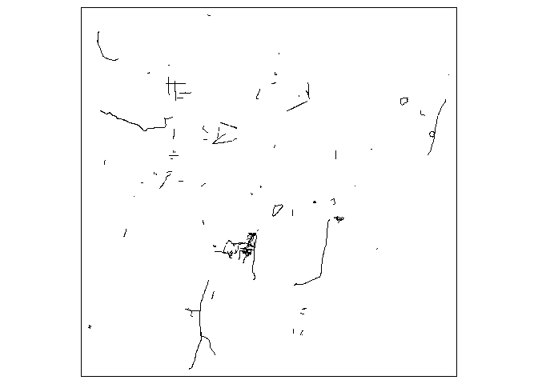

Day16
================
Anirudh Govind
(16 November, 2020)

## Load Data

``` r
# Load Bangalore ward boundary

bangaloreWardBoundary <- read_sf(here::here("data/raw-data/bangaloreWardBoundary.shp"))

bangaloreWardBoundary <- bangaloreWardBoundary%>% 
  st_transform(3857)
```

``` r
# Load in previously downloaded data from OSM
# 
# bangaloreBuildings <- readRDS(here::here("data/raw-data/bangaloreBuildings.rds"))
# 
# bangaloreBuildings <- bangaloreBuildings %>% 
#   select(osm_id, geometry)
# 
# bangaloreBuildings <- bangaloreBuildings %>%
#   st_transform(3857)
```

``` r
# Get cycle path data from OSM. Looks like there are multiple tags for cycleways. I'll have to query OSM multiple times.

# Query A
# 
# queryA <- getbb("Bangalore") %>%
#   opq() %>%
#   add_osm_feature("cycleway")
# 
# str(queryA)
# 
# cycleWaysA <- osmdata_sf(queryA)
# 
# saveRDS(cycleWaysA, here::here("data/raw-data/cycleWaysA.rds"))

cycleWaysA <- readRDS(here::here("data/raw-data/cycleWaysA.rds"))

# Query B
# 
# queryB <- getbb("Bangalore") %>% 
#   opq() %>% 
#   add_osm_feature("highway", "cycleway")
# 
# str(queryB)
# 
# cycleWaysB <- osmdata_sf(queryB)
# 
# saveRDS(cycleWaysB, here::here("data/raw-data/cycleWaysB.rds"))

cycleWaysB <- readRDS(here::here("data/raw-data/cycleWaysB.rds"))

# Query C

# queryC <- getbb("Bangalore") %>%
#   opq() %>%
#   add_osm_feature("cycleway", "track")
# 
# str(queryC)
# 
# cycleWaysC <- osmdata_sf(queryC)
# 
# saveRDS(cycleWaysC, here::here("data/raw-data/cycleWaysC.rds"))
# 
# cycleWaysC <- readRDS(here::here("data/raw-data/cycleWaysC.rds"))

# I think that is all the tagging schemes.
```

## Wrangle Data

``` r
# Okay. So each tagging scheme contains lines as well as polygons. I'll have to extract and combine accordingly.

# Lines

cycleLinesA <- cycleWaysA$osm_lines
cycleLinesB <- cycleWaysB$osm_lines
# cycleLinesC <- cycleWaysC$osm_lines

# Polygons

cyclePolygonsA <- cycleWaysA$osm_polygons
# cyclePolygonsB <- cycleWaysB$osm_polygons
# cyclePolygonsC <- cycleWaysC$osm_polygons

# PolygonsB & C have 0 observations so I can discard them. PolygonsA are all marked as private. I want only the ones which the general public has access to, so I'm going to ignore the rest of it.

# Keep only needed info. I'm keeping only those marked explicitly as yes to bicycles. I'm also going to discard cycleLinesC.

cycleLinesA <- cycleLinesA %>% 
  filter(bicycle == "yes") %>% 
  select(osm_id, geometry)

cycleLinesB <- cycleLinesB %>% 
  select(osm_id, geometry)

# Bind rows

cycleLines <- bind_rows(cycleLinesA, cycleLinesB)

cycleLines <- cycleLines %>% 
  st_transform(3857)

# Quick viz

tm_shape(cycleLines) +
  tm_lines()
```

<!-- -->

``` r
# I want to present the areas around these cyclepaths as islands in Bangalore. I'll show the buildings within these buffers as islands. I like the visuals of townscaper the video game and will try and replicate them.
```

``` r
# Buffers of 1000m around the cycle lines

cycleIslands <- st_buffer(cycleLines,
                          singleSide = T,
                          dist = c(900, -100))

# Clip to Bangalore's boundary

cycleIslands <- st_intersection(cycleIslands, bangaloreWardBoundary)
```

    ## Warning: attribute variables are assumed to be spatially constant throughout all
    ## geometries

``` r
# Okay. I quite like the output that's showing up with the test visuals. The variable buffers make a huge difference.

cycleIslandsBoundary <- st_union(cycleIslands)

# I want buffers around the islands

cycleIslandsBufferA <- st_buffer(cycleIslandsBoundary, 100)

cycleIslandsBufferA <- st_intersection(cycleIslandsBufferA, bangaloreWardBoundary)

cycleIslandsBufferB <- st_buffer(cycleIslandsBoundary, 600)

cycleIslandsBufferB <- st_intersection(cycleIslandsBufferB, bangaloreWardBoundary)

cycleIslandsBufferC <- st_buffer(cycleIslandsBoundary, 1000)

cycleIslandsBufferC <- st_intersection(cycleIslandsBufferC, bangaloreWardBoundary)

cycleIslandsBufferD <- st_buffer(cycleIslandsBoundary, 5000)

cycleIslandsBufferD <- st_intersection(cycleIslandsBufferD, bangaloreWardBoundary)
```

``` r
# Clip to buildings
# 
# buildingIslands <- st_intersection(bangaloreBuildings, cycleIslands)
# 
# buildingIslands <- buildingIslands %>% 
#   select(osm_id, geometry) %>% 
#   st_union(.)

# Okay. The buildings don't look great. I'm going to leave them out.
```

## Build Map

``` r
# Palettes

# Blue: "#219ebc"
# Browns: "#edc4b3" "#c38e70" "#774936"

# Put layers together

mapBangaloreCycleIslands <- tm_shape(bangaloreWardBoundary) +
  tm_fill(col = "#219ebc") + 
  tm_borders(col = "#ffffff",
             lwd = 3,
             lty = "dashed") +
  tm_layout(bg.color = "#219ebc",
            frame = F,
            attr.outside = T,
            outer.margins = 0,
            asp = 0,
            scale = 0.8,
            main.title = "Bangalore's Cycle Network Exaggerated as Islands",
            main.title.color = "#ffffff",
            main.title.size = 1.75,
            main.title.fontface = 2,
            main.title.fontfamily = "Arial Narrow") + 
  tm_credits("#30DayMapChallenge | Day 16 | Anirudh Govind | Nov 2020\nMap data © OpenStreetMap contributors and available from https://www.openstreetmap.org",
             col = "#ffffff",
             size = 0.8,
             position = c("left", "bottom"),
             fontfamily = "Arial Narrow") +
  tm_shape(cycleIslands) +
  tm_fill(col = "#edc4b3") +
  tm_shape(cycleIslandsBoundary) +
  tm_borders(col = "#ffffff") +
  tm_shape(cycleIslandsBufferA) +
  tm_borders(col = "#ffffff",
             lwd = 0.75) +
  tm_shape(cycleIslandsBufferB) +
  tm_borders(col = "#ffffff",
             lwd = 0.45,
             alpha = 0.6) +
  tm_shape(cycleIslandsBufferC) +
  tm_borders(col = "#ffffff",
             lwd = 0.25,
             alpha = 0.3) +
  tm_shape(cycleIslandsBufferD) +
  tm_borders(col = "#ffffff",
             lwd = 0.15,
             alpha = 0.5)
```

## Export Map

``` r
# Export the map as an image to upload onto twitter

tmap_save(tm = mapBangaloreCycleIslands,
          filename = here::here("exports/Day16.png"),
          dpi = 450,
          width = 200,
          height = 200,
          units = "mm")
```

    ## Map saved to G:\00_Git Repos\30DayMapChallenge\exports\Day16.png

    ## Resolution: 3543.307 by 3543.307 pixels

    ## Size: 7.874016 by 7.874016 inches (450 dpi)
