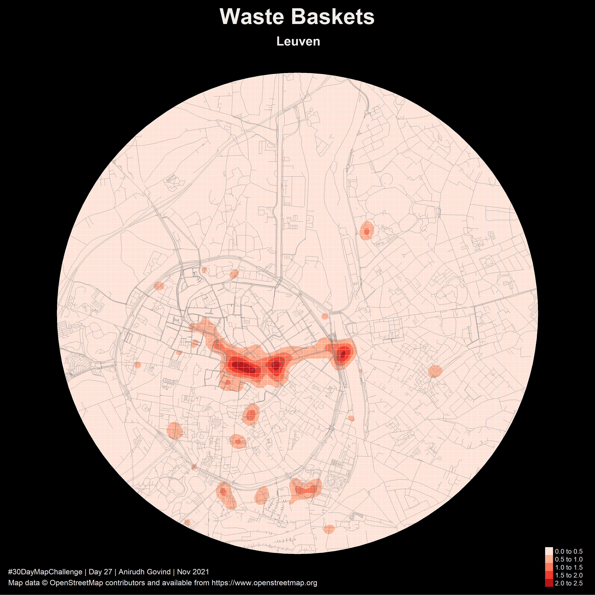

This README and repository is a work in progress and still being edited.

# 30DayMapChallenge

This repo contains all the code I used to create maps for the #30DayMapChallenge 2021 (started by Topi Tjukanov in 2019). The themes for the maps are defined in the image below.

# Credits & Data Sources

All maps were generated using the R programming language using the following packages:

1. **extrafont**: Winston Chang, (2014). extrafont: Tools for using fonts. R package version 0.17.
  https://CRAN.R-project.org/package=extrafont

2. **igraph**: Csardi G, Nepusz T: The igraph software package for complex network research, InterJournal, Complex Systems 1695. 2006.
  https://igraph.org

3. **magick**: Jeroen Ooms (2021). magick: Advanced Graphics and
  Image-Processing in R. R package version 2.7.3.
  https://CRAN.R-project.org/package=magick

4. **osmdata**: Mark Padgham, Bob Rudis, Robin Lovelace, Maëlle Salmon (2017). osmdata Journal of Open Source
  Software, 2(14). URL https://doi.org/10.21105/joss.00305
  
5. **raster**: Robert J. Hijmans (2020). raster: Geographic Data Analysis and Modeling. R package version
  3.1-5. https://CRAN.R-project.org/package=raster

6. **rayshader**: Tyler Morgan-Wall (2020). rayshader: Create Maps and Visualize Data in 2D and 3D. R package version 0.19.4. https://github.com/tylermorganwall/rayshader

7. **rgdal**:Roger Bivand, Tim Keitt and Barry Rowlingson (2021). rgdal: Bindings for the 'Geospatial' Data Abstraction Library. R
  package version 1.5-23.
  https://CRAN.R-project.org/package=rgdal

8. **rgeos**: Roger Bivand and Colin Rundel (2020). rgeos: Interface to Geometry Engine - Open Source ('GEOS'). R package version
  0.5-5. https://CRAN.R-project.org/package=rgeos

9. **sf**: Pebesma, E., 2018. Simple Features for R: Standardized Support for Spatial Vector Data. The R
  Journal 10 (1), 439-446, https://doi.org/10.32614/RJ-2018-009

10. **stars**: Edzer Pebesma (2021). stars: Spatiotemporal Arrays, Raster and Vector Data Cubes. R package version 0.5-3.
  https://CRAN.R-project.org/package=stars

11. **tidygraph**:  Thomas Lin Pedersen (2020). tidygraph: A Tidy API for Graph Manipulation. R package version 1.2.0.
  https://CRAN.R-project.org/package=tidygraph

12. **tidyverse**: Wickham et al., (2019). Welcome to the tidyverse. Journal of Open Source Software, 4(43), 1686,
  https://doi.org/10.21105/joss.01686

13. **tmap**: Tennekes M (2018). “tmap: Thematic Maps in R.” _Journal of Statistical Software_, *84*(6), 1-39.
doi: 10.18637/jss.v084.i06 (URL: https://doi.org/10.18637/jss.v084.i06). 

Data was obtained from OpenStreetMap.
© OpenStreetMap contributors and available from https://www.openstreetmap.org
Copyright and license details can be found at https://www.openstreetmap.org/copyright

## Day 1 - Points

[Code](code/Day1.Rmd)

## Day 2 - Lines

[Code](code/Day2.Rmd)

## Day 3 - Polygons

[Code](code/Day3.Rmd)

## Day 4 - Hexagons

[Code](code/Day4.Rmd)

## Day 5 - Data Challenge 1: OpenStreetMap

[Code](code/Day5.Rmd)

## Day 6 - Red

[Code](code/Day6.Rmd)

## Day 7 - Green

[Code](code/Day7.Rmd)

## Day 8 - Blue

[Code](code/Day8.Rmd)

## Day 9 - Monochrome

[Code](code/Day9.Rmd)

## Day 10 - Raster

[Code](code/Day10.Rmd)

## Day 11 - 3D

[Code](code/Day11.Rmd)

## Day 12 - Population

[Code](code/Day12.Rmd)

## Day 13 - Data Challenge 2: Natural Earth

[Code](code/Day13.Rmd)

## Day 14 - Map with a new tool

[Code](code/Day14.Rmd)

## Day 15 - Map made without using a computer

## Day 16 - Urban/ rural

[Code](code/Day16.Rmd)

## Day 17 - Land

[Code](code/Day17.Rmd)

## Day 18 - Water

[Code](code/Day18.Rmd)

## Day 19 - Island(s)

[Code](code/Day19.Rmd)

## Day 20 - Movement

[Code](code/Day20.Rmd)

## Day 21 - Elevation

[Code](code/Day21.Rmd)

## Day 22 - Boundaries

[Code](code/Day22.Rmd)

## Day 23 - Data challenge 3: GHSL

[Code](code/Day23.Rmd)

## Day 24 - Historical Map

[Code](code/Day24.Rmd)

## Day 25 - Interactive Map

[Code](code/Day25.Rmd)

## Day 26 - Choropleth Map

[Code](code/Day26.Rmd)

## Day 27 - Heatmap

[Code](code/Day27.Rmd)

## Day 28 - The Earth is not flat

[Code](code/Day28.Rmd)

## Day 29 - NULL

[Code](code/Day29.Rmd)

## Day 30 - Metamapping Day

[Code](code/Day30.Rmd)
