This README and repository is still being edited with the latest edit being on 20 November 2020.

# 30DayMapChallenge

This repo contains all the code I used to create maps for the #30DayMapChallenge 2020 (started by Topi Tjukanov in 2019). The themes for the maps are defined in the image below.

All my maps are about Bangalore, India and rely on data from open sources, primarily OpenStreetMap.

# Credits & Data Sources

All maps were generated using the R programming language using the following packages:

1. **cartography**: Giraud, T. and Lambert, N. (2016). cartography: Create and Integrate Maps in your R Workflow.
  JOSS, 1(4). doi: 10.21105/joss.00054.
  
2. **extrafont**: Winston Chang, (2014). extrafont: Tools for using fonts. R package version 0.17.
  https://CRAN.R-project.org/package=extrafont

3. **imager**: Simon Barthelme (2020). imager: Image Processing Library Based on 'CImg'. R package version
  0.42.3. https://CRAN.R-project.org/package=imager

4. **mapedit**: Tim Appelhans, Kenton Russell and Lorenzo Busetto (2020). mapedit: Interactive Editing of
  Spatial Data in R. R package version 0.6.0. https://CRAN.R-project.org/package=mapedit

5. **mapview**: Tim Appelhans, Florian Detsch, Christoph Reudenbach and Stefan Woellauer (2020). mapview:
  Interactive Viewing of Spatial Data in R. R package version 2.7.8.
  https://CRAN.R-project.org/package=mapview

6. **osmdata**: Mark Padgham, Bob Rudis, Robin Lovelace, Maëlle Salmon (2017). osmdata Journal of Open Source
  Software, 2(14). URL https://doi.org/10.21105/joss.00305
  
7. **raster**: Robert J. Hijmans (2020). raster: Geographic Data Analysis and Modeling. R package version
  3.1-5. https://CRAN.R-project.org/package=raster

8. **rayshader**: Tyler Morgan-Wall (2020). rayshader: Create Maps and Visualize Data in 2D and 3D. R package version 0.19.4. https://github.com/tylermorganwall/rayshader

9. **scales**: Hadley Wickham and Dana Seidel (2020). scales: Scale Functions for Visualization. R package
  version 1.1.1. https://CRAN.R-project.org/package=scales

10. **sf**: Pebesma, E., 2018. Simple Features for R: Standardized Support for Spatial Vector Data. The R
  Journal 10 (1), 439-446, https://doi.org/10.32614/RJ-2018-009

11. **tidyverse**: Wickham et al., (2019). Welcome to the tidyverse. Journal of Open Source Software, 4(43), 1686,
  https://doi.org/10.21105/joss.01686

12. **tmap**: Tennekes M (2018). “tmap: Thematic Maps in R.” _Journal of Statistical Software_, *84*(6), 1-39.
doi: 10.18637/jss.v084.i06 (URL: https://doi.org/10.18637/jss.v084.i06). 

13. **TSP**: Michael Hahsler and Kurt Hornik (2020). TSP: Traveling Salesperson Problem (TSP). R package
  version 1.1-10. https://CRAN.R-project.org/package=TSP. Hahsler M, Hornik K (2007). “TSP - Infrastructure   for the traveling salesperson problem.” _Journalof Statistical Software_, *23*(2), 1-21. ISSN 1548-7660,   doi: 10.18637/jss.v023.i02 (URL:   https://doi.org/10.18637/jss.v023.i02), <URL:   http://www.jstatsoft.org/v23/i02/>.

Data was obtained from OpenStreetMap.
© OpenStreetMap contributors and available from https://www.openstreetmap.org
Copyright and license details can be found at https://www.openstreetmap.org/copyright

## Day 1 - Points

**Tweet**: *"Starting the #30DayMapChallenge with a simple map of traffic lights in #Bangalore shown as points. #Bengaluru #bloremapped #maps #rspatial"*

[Code](code/Day1.md)

## Day 2 - Lines

**Tweet**: *"Building on from yesterday, for day 2 (theme of lines) of the #30DayMapChallenge I visualize all vehicular roads in #Bangalore. #Bengaluru #bloremapped #maps #rspatial"*

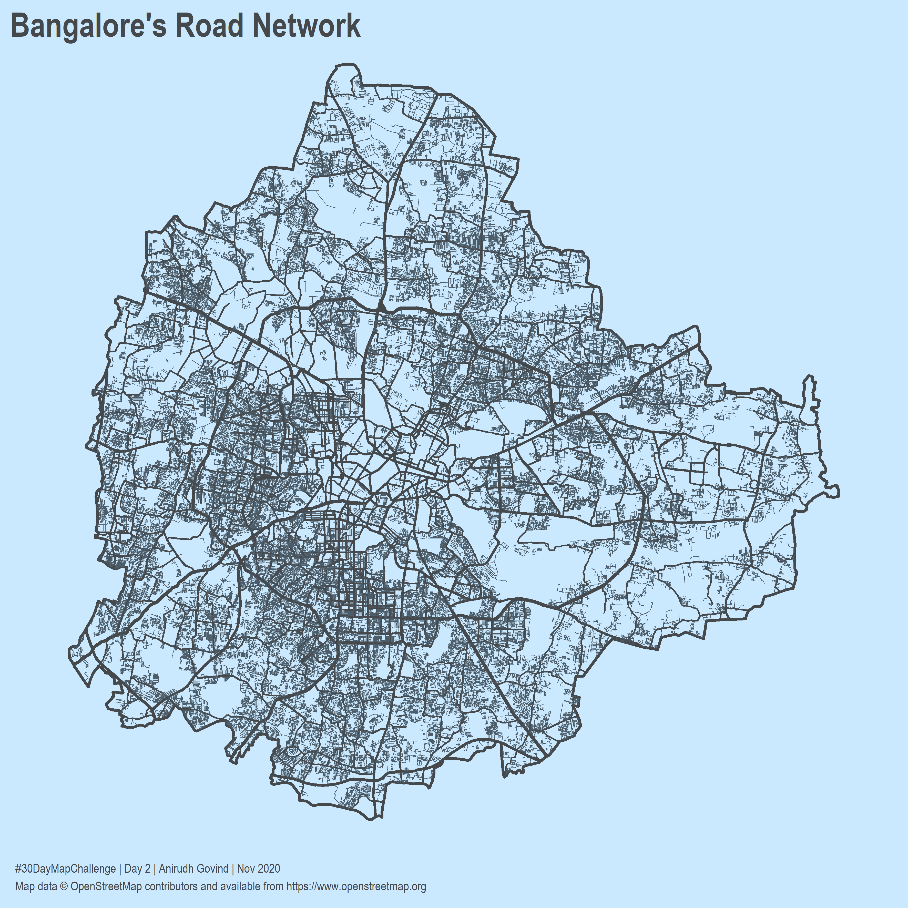
[Code](code/Day2.md)

## Day 3 - Polygons

**Tweet**: *"Polygons for day 3. Multiple maps today. Each one has 9 smaller maps with partial built fabrics for different admin wards of #Bangalore. 9 are chosen at random from 198 admin wards. I get a different set of 9 each time! #30DayMapChallenge #Bengaluru #bloremapped #maps #rspatial"*

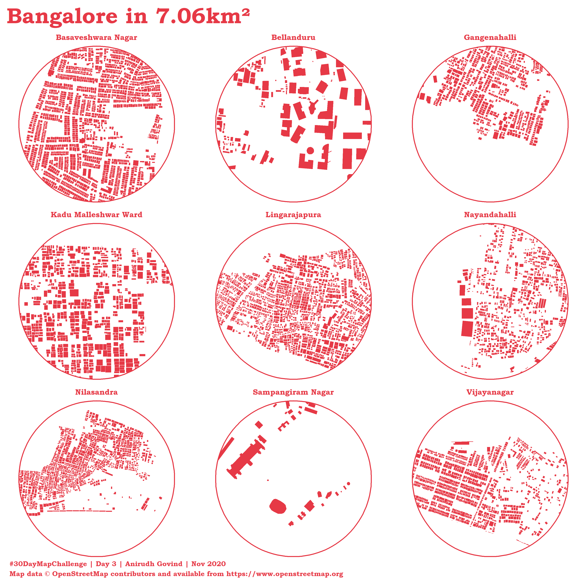
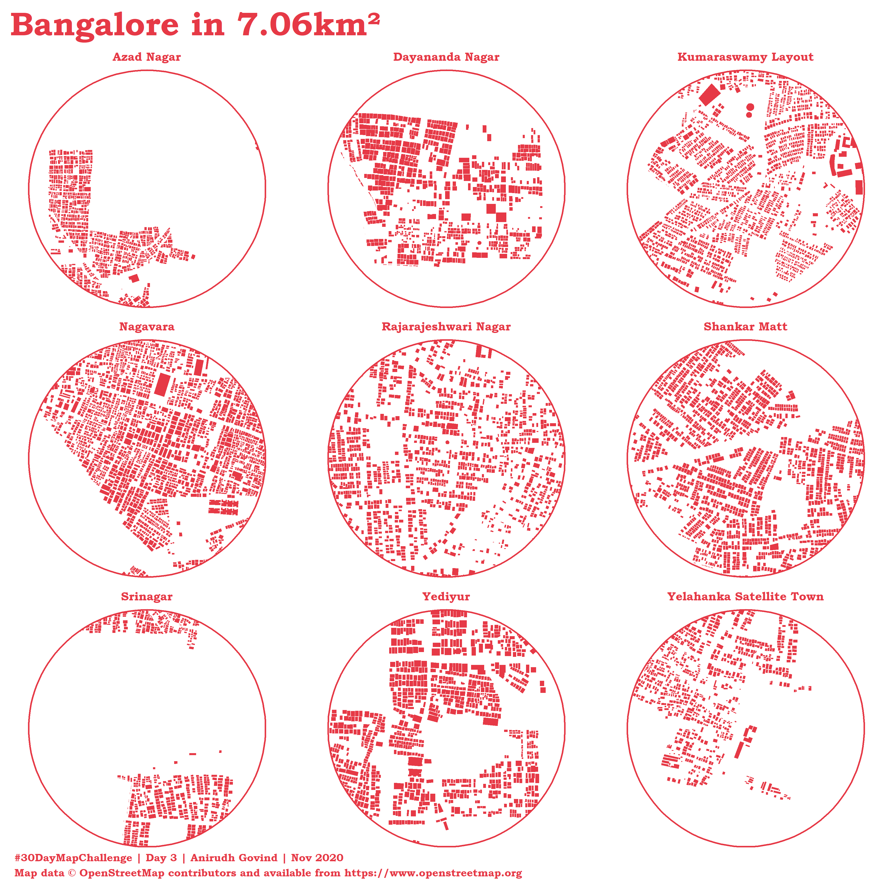
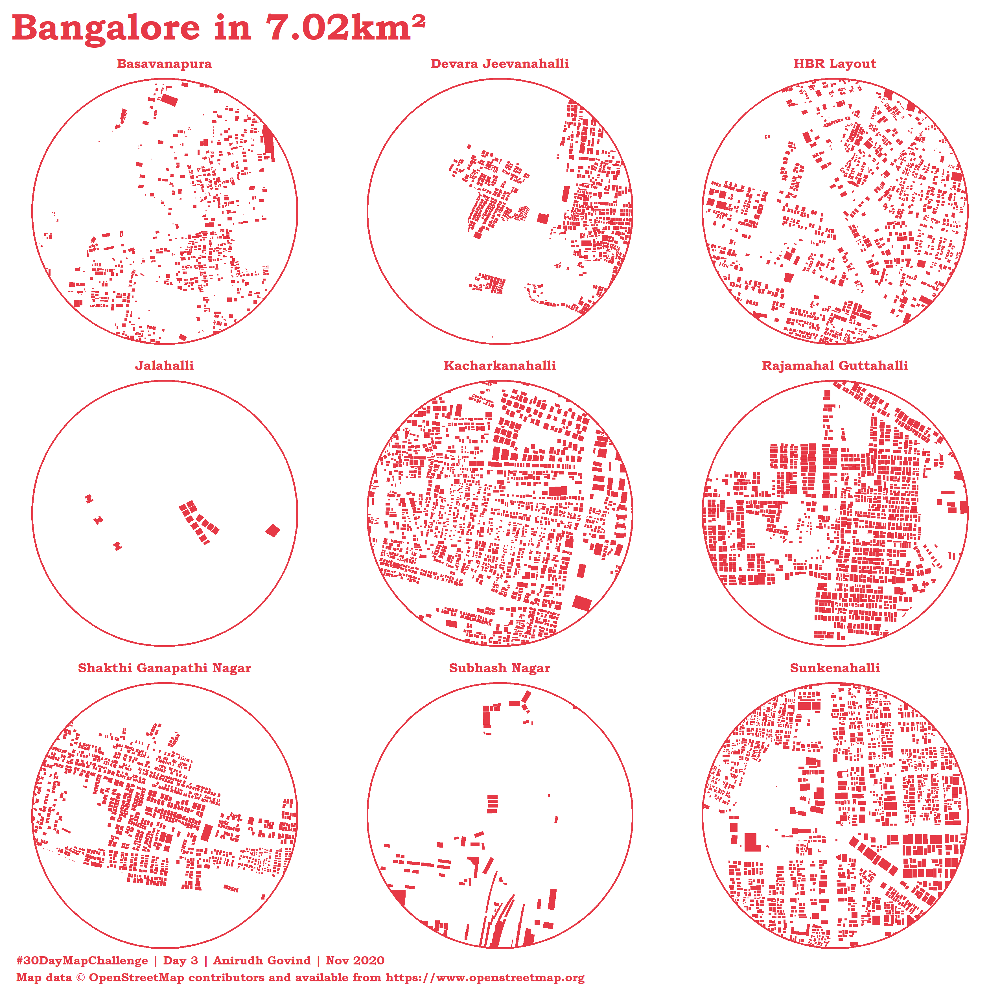
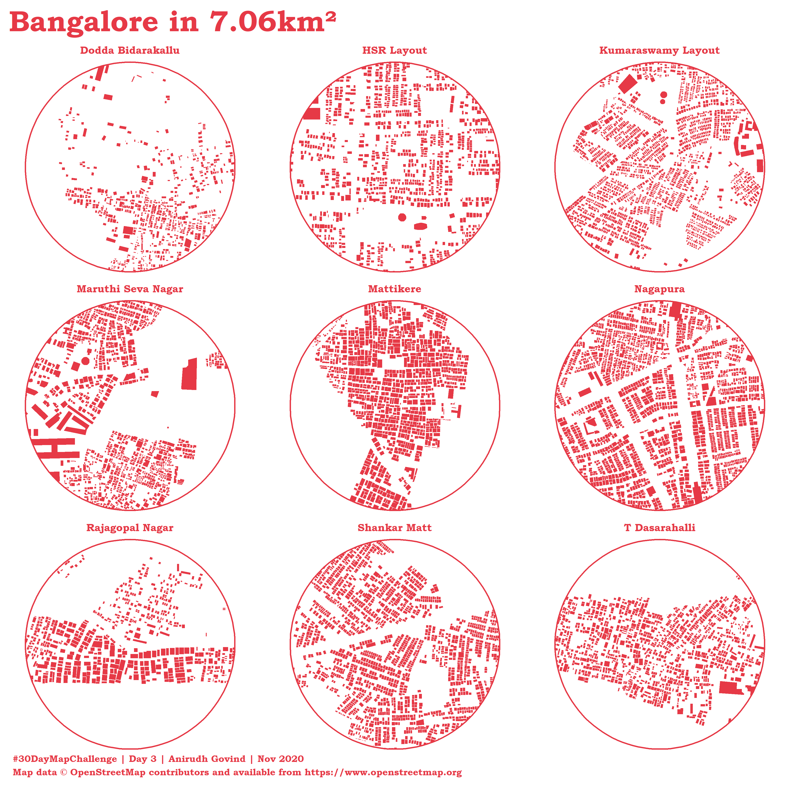
[Code](code/Day3.md)

## Day 4 - Hexagons

**Tweet**: *"Hexagons for Day 4 of the #30DayMapChallenge . Today's map shows the distribution of buildings across #Bangalore. #Bengaluru #bloremapped #maps #rspatial"*

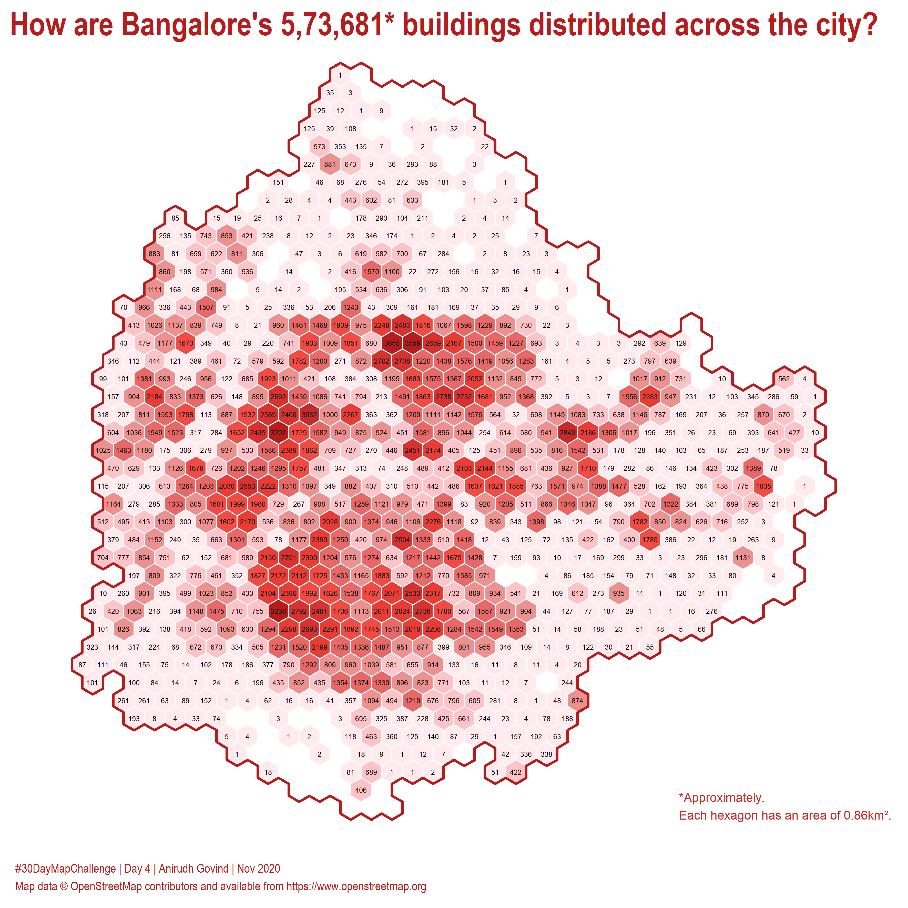
[Code](code/Day4.md)

## Day 5 - Blue
**Tweet**: *"Blue is the theme for Day 5 of the #30DayMapChallenge. I've got a WIP map of the natural waters (channels, lakes, rivers) in & around #Bangalore. #Bengaluru #bloremapped #maps #rspatial"*

[Code](code/Day5.md)

## Day 6 - Red

**Tweet**: *For Day 6 (red) of the #30DayMapChallenge, I map the areas of #Bangalore which are more than 500m away from a bus stop (as the crow flies). #Bengaluru #bloremapped #maps #rspatial*

[Code](code/Day6.md)

## Day 7 - Green

**Tweet**: *"Simple map for Day 7 (green) of the #30DayMapChallenge. Here are the parks (forests, nature reserves, etc are excluded) of #Bangalore. #Bengaluru #bloremapped #maps #rspatial"*

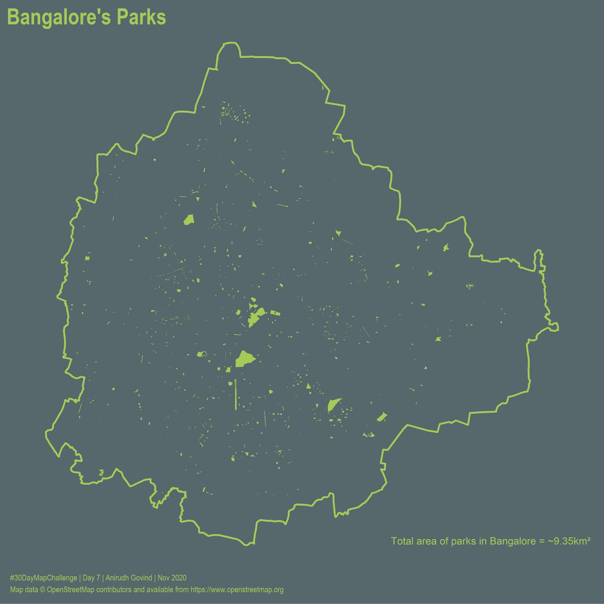
[Code](code/Day7.md)

## Day 8 - Yellow

**Tweet**: *"Day 8 (yellow) of the #30DayMapChallenge. I have walking distance estimates for RV Road Metro Station (its on the yellow line) using two methods: 500m radius & route based. Also have a similar map for the MG Road Station for comparison. #Bengaluru #bloremapped #maps #rspatial". Used the @MapBox API for routing calculations with R.*

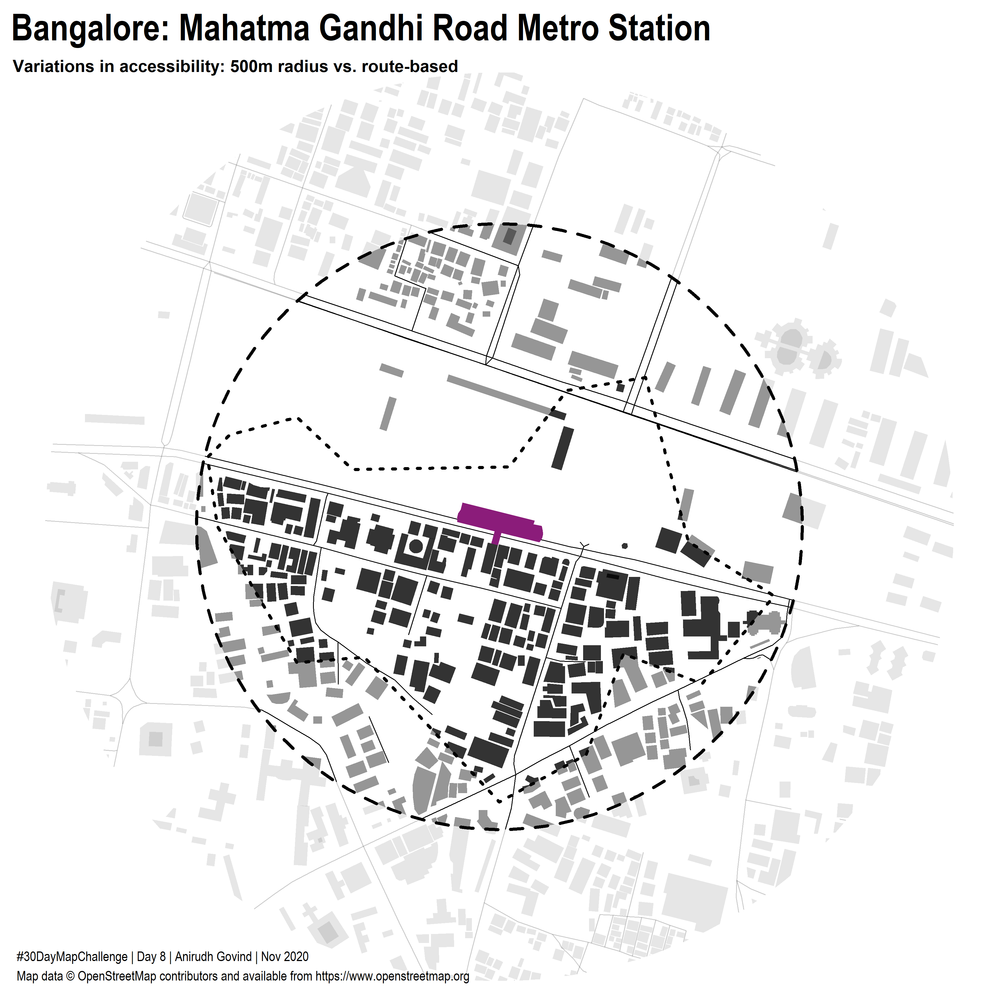
[Code](code/Day8.md)

## Day 9 - Monochrome

**Tweet**: *"For Day 9, I've got a monochrome map of Basavanagudi and surrounding areas in #Bangalore. #30DayMapChallenge #Bengaluru #bloremapped #maps #rspatial"*

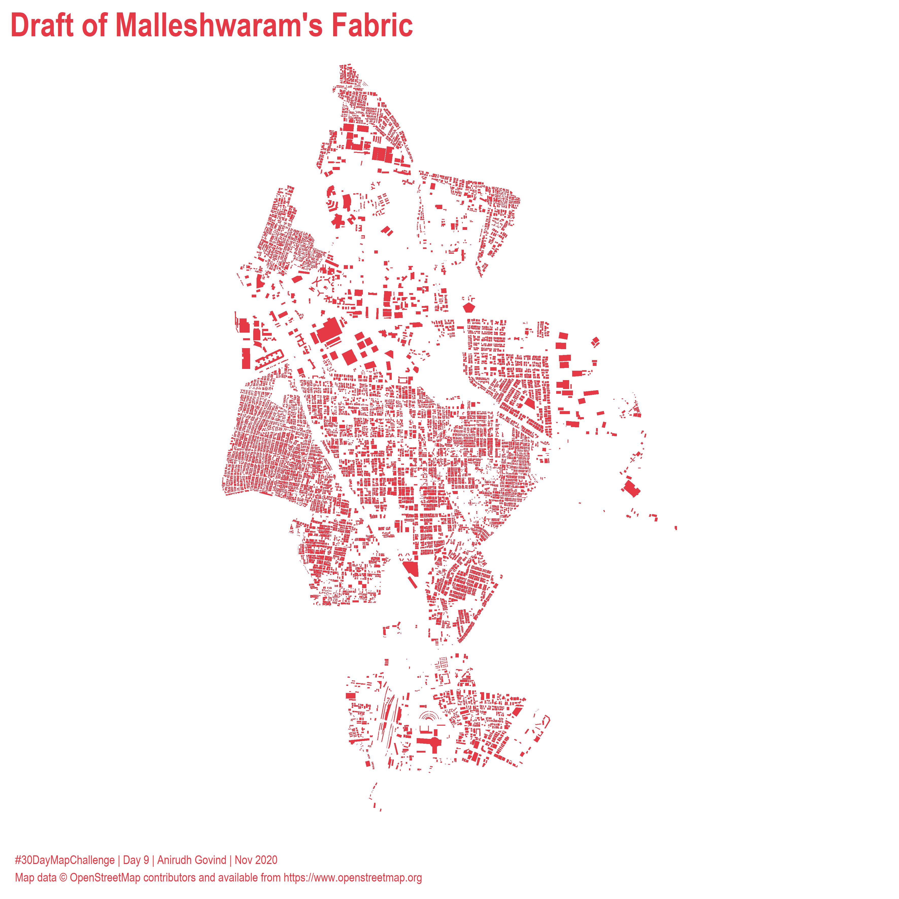
[Code](code/Day9.md)

## Day 10 - Grid

**Tweet**: *"The grid of Jayanagar's streets is the focus of my map for Day 10 of the #30DayMapChallenge. #Bangalore #Bengaluru #bloremapped #maps #rspatial"*

[Code](code/Day10.md)

## Day 11 - 3D

**Tweet**: *"Tried making 3D maps using R for the first time today. Used the really cool #rayshader package. Here are the WIP outputs. Same data as Day 4 showing the distribution of buildings across #Bangalore. #30DayMapChallenge #Bengaluru #bloremapped #maps #rspatial"*

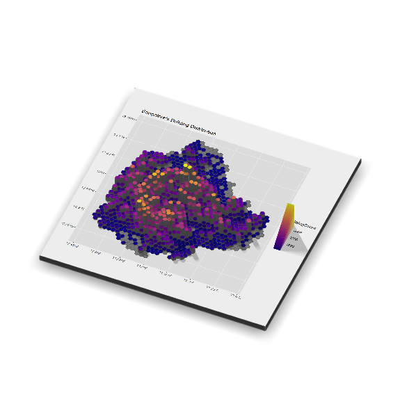

[Code](code/Day11.md)

## Day 12 - Map not made with GIS Software

**Tweet**: *"CityLab's article on "memory maps" was the inspiration for today's map (that was not made with GIS software). Here's my memory map of #Bangalore for Day 12 of the #30DayMapChallenge, made using Photoshop. #Bengaluru #bloremapped #maps". Here's the link to the article: https://bloomberg.com/news/articles/2015-11-10/what-cities-look-like-when-your-brain-does-the-mapping-without-gps Very interesting maps!*

[Code](https://www.youtube.com/watch?v=dQw4w9WgXcQ&feature=youtu.be&t=85)

## Day 13 - Raster

**Tweet**: *"Today (Day 13) I made a quick population map of #Bangalore using raster data from @WorldPopProject. Appears to underestimate Bangalore's population; especially in the east and south. Not sure why. #30DayMapChallenge #Bengaluru #bloremapped #maps #rspatial"*

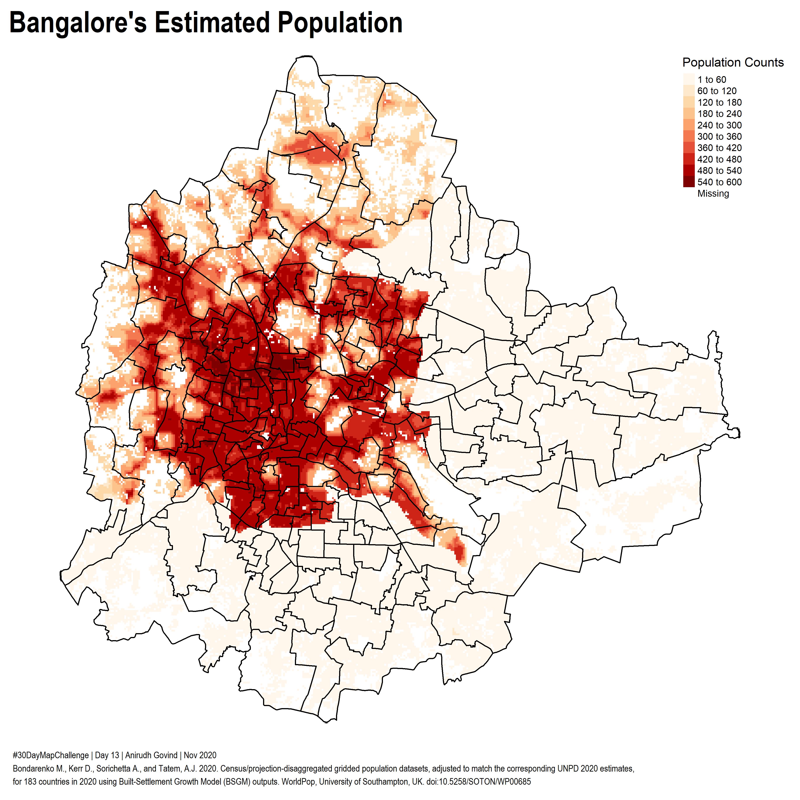
[Code](code/Day13.md)

## Day 14 - Climate Change

**Tweet**: *"Day 14's theme is climate change. Today I build on one of my previous maps. The cross marks indicate lakes which are no longer around due to urbanization/changes in flows/ climate change (in a roundabout way). #30DayMapChallenge #Bangalore #Bengaluru #bloremapped #maps #rspatial"*

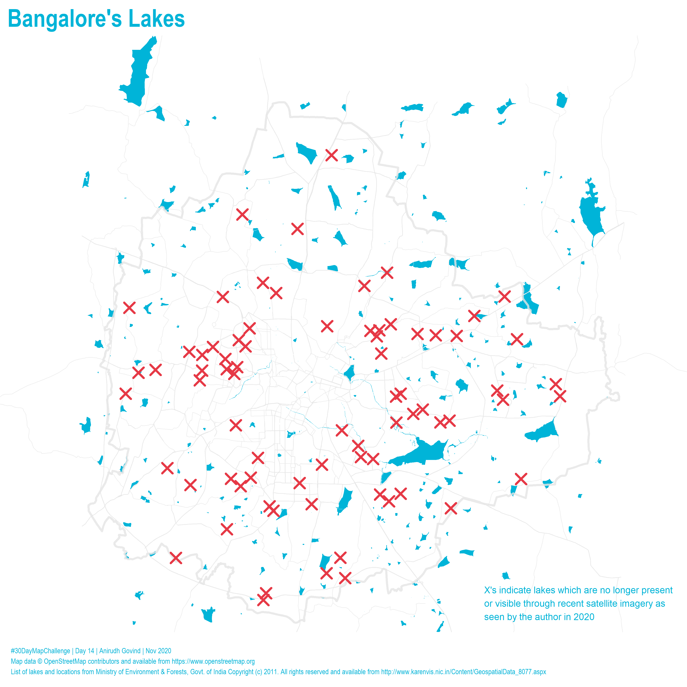
[Code](code/Day14.md)

## Day 15 - Connections

**Tweet**: *"I was exploring the TSP for Day 15 (connections) of the #30DayMapChallenge when I found @aschinchon's awesome experiment using TSP algorithms to draw portraits.  So here is #Bangalore as a TSP Portrait! B&W version of Day 2's map was input. #Bengaluru #bloremapped #maps #rspatial"*

[Code](code/Day15.md)

## Day 16 - Islands

**Tweet**: *"I was looking at the disjointed cycle networks in #Bangalore  & decided to try and present them as islands for Day 16 of the #30DayMapChallenge . Tons of artistic license + asymmetric buffers + experimentation + exaggeration led to this! #Bengaluru #bloremapped #maps #rspatial"*

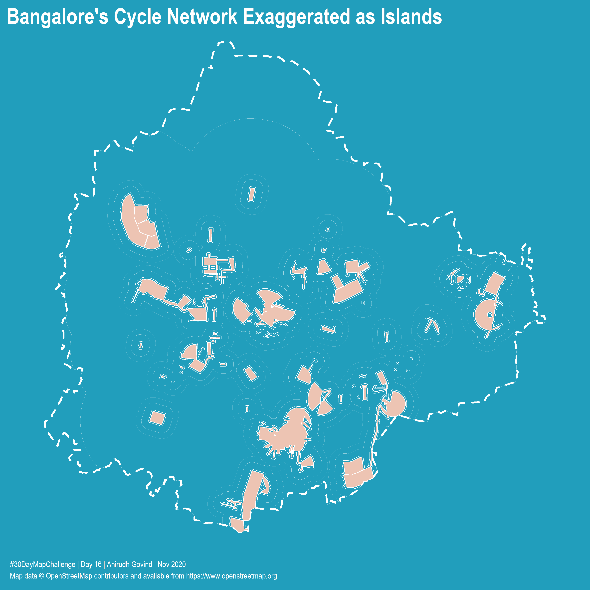
[Code](code/Day16.md)

## Day 17 - Historical Map

**Tweet**: *"Day 17's theme is the historical map. Compared conditions today with a map from 1797. Link to the original: https://warper.wmflabs.org/maps/2020#Preview_tab Also, worth taking a look at the sat image: https://goo.gl/maps/tLFG5dbhTmEwEVw58 #30DayMapChallenge #Bangalore #Bengaluru #bloremapped #maps #rspatial"*

[Code](code/Day17.md)

## Day 18 - Landuse

**Tweet**: *"Really quick maps today (Day 18) showing the landuse around MG Road Metro Station in #Bangalore. Colours aren't official and only indicative. Also tried a B&W version. #30DayMapChallenge #Bengaluru #bloremapped #maps #rspatial "*

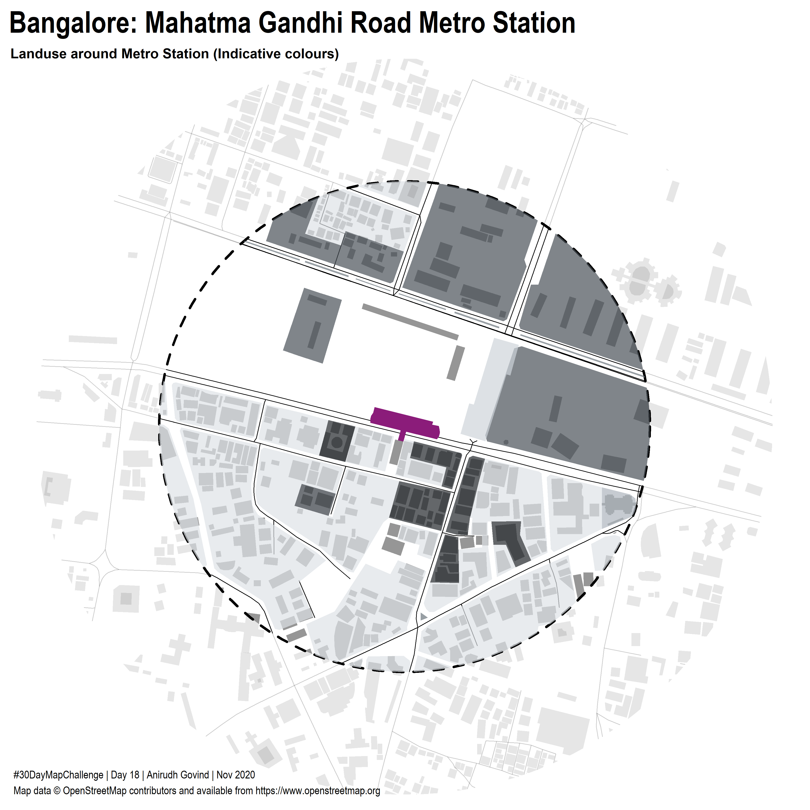

[Code](Code/Day18.md)

## Day 19 - NULL

**Tweet**: *"Okay. Haven't quite figured it out yet but I was trying to use a diverging palette to show missing or unlikely data for Day 19 (NULL) of the #30DayMapChallenge. #Bangalore #Bengaluru #bloremapped #maps #rspatial"*

[Code](code/Day19.md)

# Day 20 - Population

**Tweet**: *"Okay. Starting to think South and East #Bangalore aren't as dense as I think they are. Or data is missing. For Day 20 of the #30DayMapChallenge I have a pop density raster map.#Bengaluru #bloremapped #maps #rspatial"*

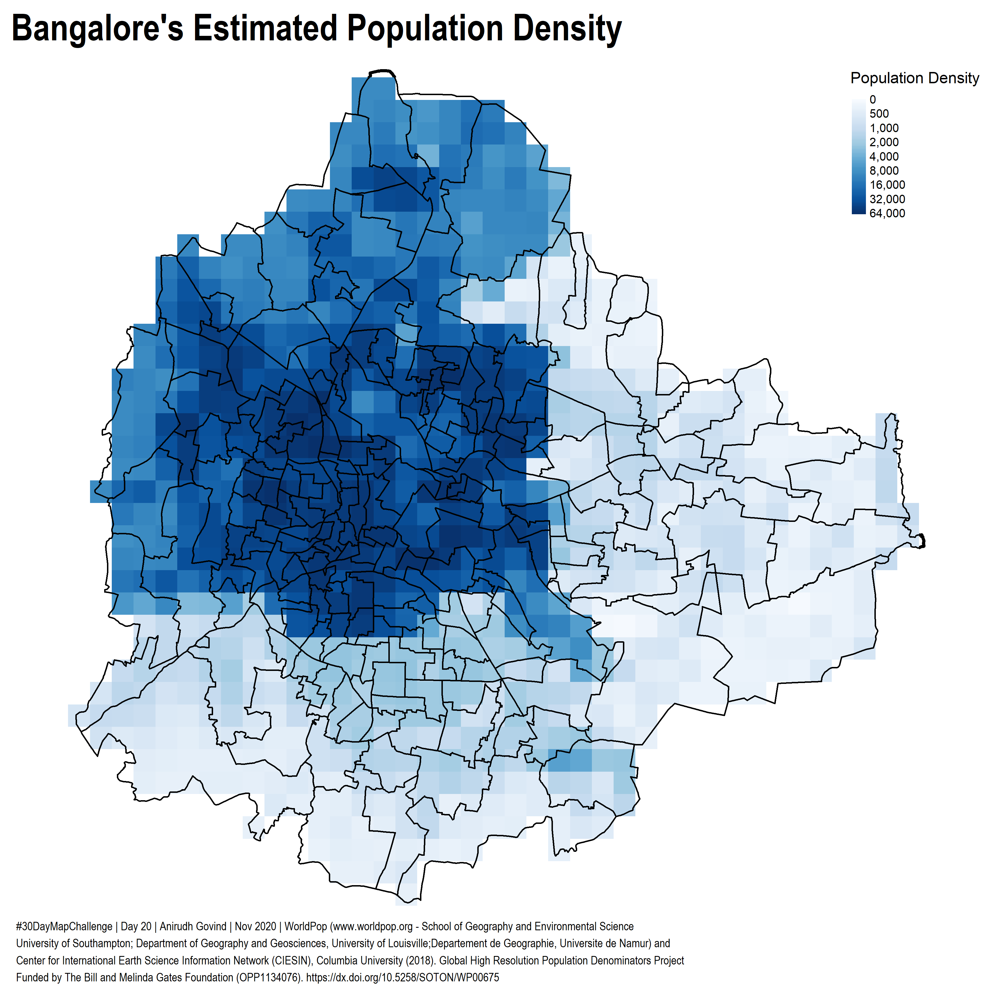
[Code](code/Day20.md)

# Day 21 - Water

**Tweet**: *"Today (Day 21) I'm looking at the difference in the billed and collected water taxes by admin ward in #Bangalore over a 4 year period. Data from https://smartcities.data.gov.in/catalog/water-tax-bengaluru?filters%5Bfield_catalog_reference%5D=2914701&format=json&offset=0&limit=9&sort%5Bcreated%5D=desc #30DayMapChallenge #Bengaluru #bloremapped #maps #rspatial As per the dataset (billed - collected = 0) in only one instance!"*

[Code](code/Day21.md)